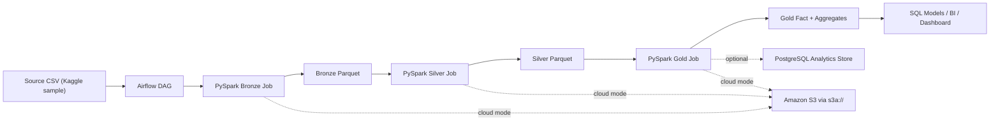
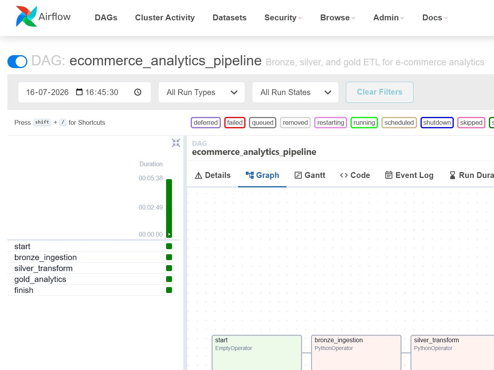
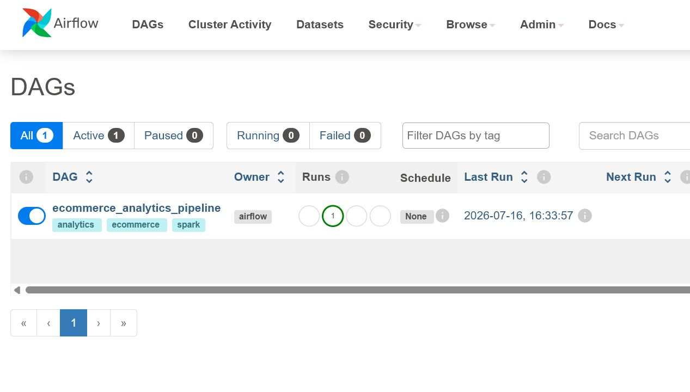

# Cloud Data Engineering Pipeline for E-Commerce Analytics

An end-to-end e-commerce analytics pipeline built with Airflow, PySpark, Docker, and SQL. The project ingests a public e-commerce dataset, scales it into a 1.5M+ row workload for performance testing, transforms it through bronze, silver, and gold layers, and publishes analytics-ready datasets for downstream BI and SQL reporting.

## Outcome

- Built an end-to-end cloud ETL pipeline using Airflow, PySpark, and Docker to automate ingestion and transformation of 1.5M+ e-commerce records.
- Containerized the workflow and documented the repository with Airflow DAGs, PySpark jobs, SQL models, architecture diagrams, and deployment instructions.

## Architecture



More design notes live in [docs/architecture.md](docs/architecture.md).

## Tech Stack

- Orchestration: Apache Airflow
- Distributed processing: PySpark
- Packaging and runtime: Docker, Docker Compose
- Storage: Local parquet for development, Amazon S3-compatible paths for cloud mode
- Analytics: SQL models, PostgreSQL-compatible warehouse DDL

## Project Structure

```text
ecommerce/
|-- dags/
|   `-- ecommerce_analytics_pipeline.py
|-- docs/
|   `-- architecture.md
|-- jobs/
|   `-- pyspark/
|       |-- bronze_ingestion.py
|       |-- common.py
|       |-- gold_analytics.py
|       `-- silver_transform.py
|-- pipeline/
|   `-- config.py
|-- scripts/
|   |-- check_setup.py
|   |-- extract.py
|   |-- load_postgres.py
|   |-- transform.py
|   `-- upload_s3.py
|-- sql/
|   |-- business_queries.sql
|   |-- schema.sql
|   |-- views.sql
|   `-- models/
|       |-- marts/
|       `-- staging/
|-- data/
|   |-- raw/
|   `-- processed/
|-- docker-compose.yml
|-- Dockerfile.airflow
|-- requirements-docker.txt
`-- requirements.txt
```

## Data Flow

1. The repo starts from `data/raw/ecommerce_sales.csv`, a public sample dataset.
2. The bronze Spark job lands the file into parquet and scales it to `12x`, creating `1,547,700` records for pipeline testing.
3. The silver Spark job standardizes columns, cleans nulls, casts types, removes invalid rows, and derives analytics fields.
4. The gold Spark job materializes analytics tables such as `fct_orders`, `dim_products`, `agg_daily_sales`, `agg_monthly_sales`, and `agg_state_sales`.
5. SQL models and business queries expose the curated data to dashboards or warehouse consumers.

## Quick Start

### 1. Download the dataset

This project expects the raw source file at:

```text
data/raw/ecommerce_sales.csv
```

Download the e-commerce source CSV from Kaggle, then place it in the `data/raw/` folder and rename it to `ecommerce_sales.csv` if needed.

Recommended source:

- Kaggle search: [Amazon Sale Report datasets](https://www.kaggle.com/search?q=amazon+sale+report)

Expected final location:

```text
data/raw/ecommerce_sales.csv
```

### 2. Prepare environment variables

Copy [`.env.example`](.env.example) to `.env` and adjust values as needed.

Important defaults:

- `PIPELINE_SCALE_FACTOR=12`
- `PIPELINE_STORAGE_MODE=local`
- `PIPELINE_RAW_SOURCE_PATH=/opt/airflow/data/raw/ecommerce_sales.csv`
- `PIPELINE_OUTPUT_ROOT=/opt/airflow/data/processed`

### 3. Validate local setup

Run the setup checker before starting Docker:

```bash
python scripts/check_setup.py
```

The checker validates:

- `.env` exists
- `data/raw/ecommerce_sales.csv` exists
- the dataset is readable and includes rows

### 4. Launch the stack

```bash
docker compose up airflow-init
docker compose up -d
```

Airflow will be available at [http://localhost:8080](http://localhost:8080).

Default credentials:

- Username: `airflow`
- Password: `airflow`

### 5. Trigger the pipeline

Enable and run the DAG `ecommerce_analytics_pipeline`, or trigger it from the CLI:

```bash
docker compose exec airflow-webserver airflow dags trigger ecommerce_analytics_pipeline
```

### 6. Inspect outputs

Generated parquet datasets will be written under:

- `data/processed/bronze/orders`
- `data/processed/silver/orders`
- `data/processed/gold/fct_orders`
- `data/processed/gold/agg_monthly_sales`

## Pipeline Execution

The Airflow DAG was run successfully on July 16, 2026. The screenshots below show the orchestrated pipeline and the completed DAG run in the Airflow UI.

### DAG Graph View



### Airflow DAG List



This run executed the following tasks in sequence:

1. `start`
2. `bronze_ingestion`
3. `silver_transform`
4. `gold_analytics`
5. `finish`

## Running Spark Jobs Without Airflow

Inside the Airflow container:

```bash
spark-submit /opt/airflow/jobs/pyspark/bronze_ingestion.py
spark-submit /opt/airflow/jobs/pyspark/silver_transform.py
spark-submit /opt/airflow/jobs/pyspark/gold_analytics.py
```

## Cloud Mode

Switch from local storage to S3 by changing:

```env
PIPELINE_STORAGE_MODE=s3
PIPELINE_S3_BUCKET=your-bucket-name
PIPELINE_S3_PREFIX=ecommerce-analytics
AWS_ACCESS_KEY_ID=...
AWS_SECRET_ACCESS_KEY=...
AWS_DEFAULT_REGION=us-east-1
```

The Spark jobs will then read and write `s3a://` paths instead of local parquet directories.

## SQL Assets

- Warehouse DDL: [sql/schema.sql](sql/schema.sql)
- Reusable views: [sql/views.sql](sql/views.sql)
- Staging and mart models: [sql/models](sql/models)
- Analyst queries: [sql/business_queries.sql](sql/business_queries.sql)

## Local Verification Performed

- Verified the dataset row count and scaling design against the source CSV.
- Verified Python syntax for the pipeline package, Airflow DAG, and job scripts with `compileall`.
- Verified the legacy extraction and transform helpers still run against the local dataset.

## Portfolio Summary

Use this project summary in your resume or GitHub description:

> Built an end-to-end cloud ETL pipeline using Airflow, PySpark, and Docker to automate ingestion and transformation of 1.5M+ e-commerce records. Containerized the workflow and published a fully documented GitHub repository, including Airflow DAGs, PySpark jobs, SQL models, architecture diagrams, and deployment instructions.
