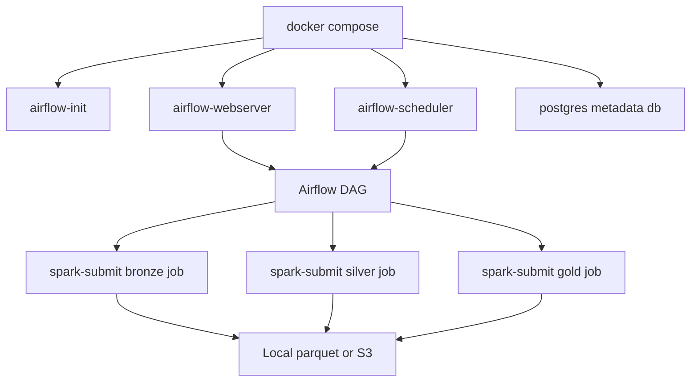

# Architecture Notes

## Design Goals

- Keep local development simple enough to run from Docker Compose.
- Keep the storage abstraction flexible so the same jobs can write to local parquet or Amazon S3.
- Use medallion-style data layers to make pipeline stages easy to explain in interviews and easy to validate operationally.

## Pipeline Layers

### Bronze

- Reads the source CSV exactly as landed.
- Adds ingestion metadata such as `ingested_at`, `source_file`, and `scale_batch`.
- Expands the base dataset by the configured `PIPELINE_SCALE_FACTOR` for higher-volume testing.

### Silver

- Standardizes column names and data types.
- Removes invalid records and fills missing numeric measures.
- Derives business fields such as `sales`, `order_year`, `order_month`, and `is_cancelled`.

### Gold

- Publishes analytics-ready fact and dimension datasets.
- Produces reusable aggregates for daily, monthly, and geographic reporting.

## Deployment Shape

## Why the Repo Uses a 12x Scale Factor

The checked-in source file contains 128,975 rows. Setting `PIPELINE_SCALE_FACTOR=12` generates 1,547,700 records during bronze ingestion, which makes the project accurately demonstrable as a 1.5M+ row pipeline while still keeping the original public sample dataset in version control.
